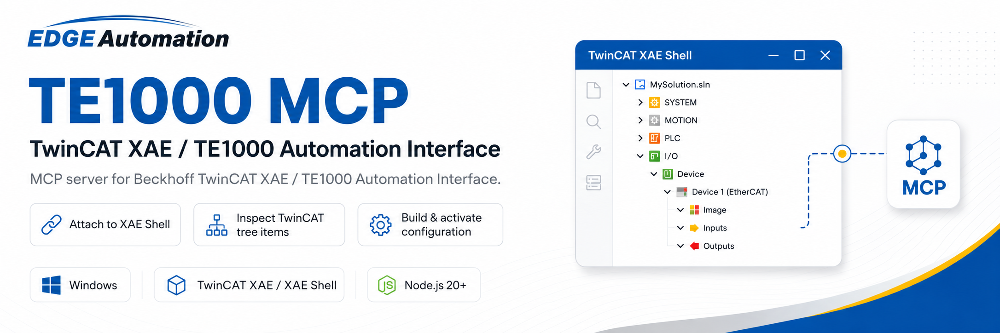

<p align="center">
  
</p>

# te1000-mcp

> A [Model Context Protocol](https://modelcontextprotocol.io) server for **Beckhoff TwinCAT 3** engineering automation — drive the **TE1000 / XAE Automation Interface** from an AI agent or any MCP client.

[](https://github.com/Edge-JB/TwinCAT-XAE-MCP/actions/workflows/ci.yml)
[](https://modelcontextprotocol.io)
[](https://nodejs.org)
[](https://www.beckhoff.com/twincat)
[](LICENSE)

`te1000-mcp` exposes the TwinCAT XAE engineering surface — the System Manager tree,
PLC project authoring, IO/EtherCAT configuration, variable linking, builds, and
runtime deployment — as a compact set of MCP tools. It talks to a **running XAE Shell**
through the TE1000 Automation Interface (COM/DTE), bridged via PowerShell, so an agent
can configure and build a TwinCAT project the same way an engineer would in the GUI.

> [!IMPORTANT]
> This server drives a **real engineering tool** and can deploy to a **live PLC**.
> Every action that touches the running target (activate, restart, download, deletes,
> licensing) is **confirmation-gated** and off by default. See [Safety & guards](#safety--guards).

---

## Contents

- [Highlights](#highlights)
- [How it works](#how-it-works)
- [Requirements](#requirements)
- [Install](#install)
- [Configure your MCP client](#configure-your-mcp-client)
- [Quickstart](#quickstart)
- [Tool reference](#tool-reference)
- [Safety & guards](#safety--guards)
- [Reliability: dialog watchdog & PLC session control](#reliability-dialog-watchdog--plc-session-control)
- [Examples](#examples)
- [Documentation](#documentation)
- [Contributing](#contributing)
- [License](#license)

---

## Highlights

- **25 noun-grouped tools** covering the automatable TE1000 surface — tree, IO/EtherCAT,
  linking, PLC project & POU authoring, libraries, tasks, mapping, routes, fieldbuses,
  TcCOM, C++, measurement/scope, licensing, and variants.
- **Batch-first** — every multi-item operation has a `*_batch` form that runs N operations
  in **one** DTE attach and returns a compact continue-on-error roll-up, instead of paying
  a process spawn + attach per call.
- **Native EtherCAT builder** — `tc_ethercat` creates fully-populated EtherCAT boxes
  (correct identity, SyncManagers, FMMUs, PDOs) for any device class by the GUI's own
  "Add Box" route, driven from the device's ESI.
- **Surgical PLC code edits** — `plc_pou` reads, greps, and patches declaration/implementation
  text in place and returns only the changed region, keeping agent context small.
- **Safe by default** — destructive and live-target actions are confirmation-gated; the
  safety project is never written to, by policy.
- **Resilient to GUI modals** — a dialog watchdog detects and (optionally) auto-dismisses
  modal dialogs that would otherwise hang a synchronous COM call forever.

## How it works

```
  MCP client (agent)
        │  stdio (JSON-RPC, MCP)
        ▼
  index.js  ──spawns──►  32-bit Windows PowerShell  ──COM/DTE──►  XAE Shell (TE1000)
   (Node 20)             powershell/te1000-bridge.ps1             running TwinCAT project
```

The Node server speaks MCP over stdio and maps each tool call onto an action in the
PowerShell **bridge** (`powershell/te1000-bridge.ps1`). The bridge attaches to the running
XAE Shell via its verified COM ProgID and calls the Automation Interface
(`ITcSysManager`, `ITcSmTreeItem`, `ITcPlcProject`, DTE `SolutionBuild`, …). 32-bit
PowerShell is used because that matches Beckhoff's TE1000 COM requirements.

## Requirements

| | |
|---|---|
| **OS** | Windows |
| **TwinCAT** | TwinCAT 3 XAE Shell / XAE installed, with the TE1000 Automation Interface |
| **PowerShell** | 32-bit Windows PowerShell at `C:\Windows\SysWOW64\WindowsPowerShell\v1.0\powershell.exe` |
| **Node.js** | 20 or newer |
| **A running XAE Shell** | the server attaches to an already-open instance (it does not launch XAE) |

The XAE ProgID defaults to `TcXaeShell.DTE.17.0`. Override it with the `TE1000_PROGID`
environment variable if your installation differs.

## Install

```powershell
git clone https://github.com/Edge-JB/TwinCAT-XAE-MCP.git
cd TwinCAT-XAE-MCP
npm install
```

Verify the server starts:

```powershell
node index.js
# -> te1000-mcp server running on stdio   (Ctrl-C to exit)
```

The server communicates over stdio and is normally launched **by an MCP client**, not by
hand. Running it directly just waits for a client on stdin.

## Configure your MCP client

Point your client at the absolute path of `index.js` in your clone. Example
(Claude Desktop / Claude Code / any MCP client that reads this shape):

```jsonc
{
  "mcpServers": {
    "te1000": {
      "command": "node",
      "args": ["C:\\path\\to\\TwinCAT-XAE-MCP\\index.js"]
    }
  }
}
```

A ready-to-edit copy lives at [`examples/mcp-config.json`](examples/mcp-config.json).

Optional environment variables:

| Variable | Default | Purpose |
|---|---|---|
| `TE1000_PROGID` | `TcXaeShell.DTE.17.0` | XAE Shell COM ProgID to attach to |
| `TE1000_DIALOG_WATCH` | on | `0` disables the modal-dialog watchdog |
| `TE1000_DIALOG_AUTODISMISS` | on | `0` = detect + report only, never auto-click |
| `TE1000_DIALOG_GRACE_MS` | `4000` | how long a blocking dialog must persist before the call is abandoned |
| `TE1000_BRIDGE_TIMEOUT_MS` | `0` (off) | optional wall-clock backstop for non-dialog hangs |

## Quickstart

With XAE Shell open on your solution, an agent can drive a full configure → build loop.
A typical session (tool name + arguments shown):

```text
# 1. Confirm the server is attached and a solution is open
xae            action: "status"

# 2. Inspect the IO tree
tc_tree        action: "children"  path: "TIID^Device 2 (EtherCAT)"

# 3. Add a populated EtherCAT rack from its ESI (digital in/out + analog)
tc_ethercat    racks: [{
                 parent: "TIID^Device 2 (EtherCAT)^R01.Main.N01 (EK1200)",
                 modules: [{ type: "EL1008" }, { type: "EL2008" }, { type: "EL3064" }]
               }]
               save: true

# 4. Link a PLC input to a terminal channel
tc_link        action: "link"
               a: "TIPC^Cabsort Lite^Cabsort Lite Instance^PlcTask Inputs^MAIN.bStart"
               b: "TIID^Device 2 (EtherCAT)^Term 1^Channel 1^Input"

# 5. Build the solution
xae_build      action: "build"

# 6. (Optional, guarded) deploy to the live target
plc_download   confirm: "ALLOW_PLC_DOWNLOAD"
```

More end-to-end recipes — bulk linking, parameter edits via `set_xml`, POU authoring —
are in [`examples/`](examples/).

## Tool reference

Paths into the System Manager tree use `^` separators, e.g.
`TIID^Device 2 (EtherCAT)^Box 1^Term 5^Channel 1`. The leading token is the tree root
(`TIPC` = PLC, `TIID` = IO, `TINC` = NC, `TIRC` = realtime/license, …).

### Engineering & build

| Tool | Purpose | Key actions |
|---|---|---|
| `xae` | XAE shell & solution control | `status`, `open_solution`, `save_all`, `active_document`, `selected_items`, `error_list`, `clear_error_list`, `list_commands` |
| `xae_build` | Compile the active configuration | `clean`, `build`, `rebuild` |
| `xae_command` | Run a raw DTE command 🔒 | any command name (guarded) |

### System Manager tree, IO & linking

| Tool | Purpose | Key actions |
|---|---|---|
| `tc_tree` | Read/write any tree item (identity, XML params, rename, create, delete) | `get`, `children`, `exists`, `get_xml`, `set_xml`, `rename`, `create`, `delete`, `import`, `export`, `focus` — each with a `*_batch` form |
| `tc_ethercat` | Build fully-populated EtherCAT boxes from their ESI | `racks: [{ parent, modules: [{ type, name?, revision? }] }]` |
| `tc_link` | Link/unlink variables; verify existing links | `link`, `unlink`, `resolve`, `links`, `link_batch`, `unlink_batch` |
| `tc_system` | Target & rescan helpers | `get_netid`, `set_netid`, `errors`, `rescan_plc`, `scan_io_boxes` |
| `tc_mapping` | Bulk variable mapping | `produce`, `consume`, `clear` |
| `nc` | NC motion tree | `tasks`, `axes`, `axis` |

### PLC project & code

| Tool | Purpose | Key actions |
|---|---|---|
| `plc_project` | PLC project lifecycle | `create_from_template`, `open`, `info`, `set_boot_flags`, `generate_boot_project` 🔒, `online` 🔒, `plcopen_export`, `plcopen_import`, `save_as_library` |
| `plc_pou` | Author + surgically edit POUs/DUTs/GVLs (offline) | author (`create`, `import_template`), read (`get_decl`, `get_impl`, `outline`, `get_graphical`), surgical (`replace`, `replace_lines`, `insert`, `append`), discover (`tree`, `find`, `search`), lifecycle (`rename`, `move`, `delete` 🔒) |
| `plc_library` | Library refs / placeholders / repos | `list`, `scan`, `add_library`, `add_placeholder`, `set_resolution`, `freeze`, `remove_reference`, `install_library` 🔒, … |
| `plc_download` | Deploy the active PLC project 🔒 | boot-project (default) or legacy command route |
| `plc_session` | Online-session control via UI Automation | `status`, `logout` 🔒 |

### Realtime, fieldbus & platform

| Tool | Purpose | Key actions |
|---|---|---|
| `tc_task` | RT tasks / cores / linked tasks | `list`, `get`, `create`, `set_params`, `add_image_var`, `get/set_rt_settings`, `bind_cpu`, `get/set_linked_task` |
| `tc_route` | ADS routes | `list`, `broadcast_search`, `search_host`, `add_route` 🔒, `add_project_route` 🔒 |
| `tc_settings` | Engineering settings & archives | `get/set_silent_mode`, `get/set_target_platform`, `save_solution_archive`, `save_plc_archive`, `get/set_independent_file`, `get/set_disabled` |
| `tc_fieldbus` | Non-EtherCAT fieldbuses (PROFINET/PROFIBUS/CANopen/DeviceNet/EAP) | `create_device`, `create_gsd_box`, `add_netvar`, `set_station_address`, `import_dbc`, `get/set_xml` |
| `tc_module` | TcCOM module objects | `list`, `create`, `get/set_xml`, `enable_symbols`, `set_context` 🔒 |
| `tc_cpp` | TwinCAT C++ projects/modules | `create_project`, `create_module`, `tmc_codegen`, `set_props`, `build`, `publish` 🔒 |
| `tc_measurement` | Scope + Analytics (TIAN) | `scope_create`, `scope_record` 🔒, `analytics_create`, `logger_create`, `stream_create`, … |
| `tc_license` | TwinCAT licensing | `list`, `add`, `activate_response` 🔒 |
| `tc_variant` | Project variant management | `get_config`, `get_current`, `set_config`, `select`, `enable`, `disable` |

### Runtime (guarded)

| Tool | Purpose |
|---|---|
| `twincat_activate_configuration` 🔒 | Activate the configuration on the target |
| `twincat_restart_runtime` 🔒 | Start/restart the TwinCAT runtime |

🔒 = confirmation-gated. See [Safety & guards](#safety--guards). Full action signatures,
batch semantics, and return shapes are documented in **[docs/tools.md](docs/tools.md)**.

## Safety & guards

The server **never auto-activates, auto-restarts, or auto-deploys**. Any action that
changes the live target, deletes a node, or alters licensing is blocked unless you pass
the matching `confirm` token:

| Confirm token | Unlocks |
|---|---|
| `ALLOW_TWINCAT_ACTIVATE` | `twincat_activate_configuration` |
| `ALLOW_TWINCAT_RESTART` | `twincat_restart_runtime` |
| `ALLOW_PLC_DOWNLOAD` | `plc_download`, `plc_project` boot/online |
| `ALLOW_XAE_COMMAND_EXEC` | `xae_command` |
| `ALLOW_PLC_LOGOUT` | `plc_session logout` |
| `ALLOW_TWINCAT_DELETE` | node/object deletes (or use `dryRun: true` to preview) |
| `ALLOW_PLC_LIBRARY_REPO` | machine-wide library repository administration |
| `ALLOW_TWINCAT_ROUTE_WRITE` | ADS route writes |
| `ALLOW_TWINCAT_MODULE_CONTEXT` | TcCOM context changes |
| `ALLOW_CPP_PUBLISH` | C++ driver publish |
| `ALLOW_MEASUREMENT_RECORD` | live scope acquisition |
| `ALLOW_LICENSE_ACTIVATE` | license activation |

**Safety project policy.** Nothing in this toolchain writes toward the TwinSAFE safety
project. Every authoring tool refuses safety-rooted (`TISC`) paths via an internal guard.
Safety remains read-only/diagnostic.

## Reliability: dialog watchdog & PLC session control

A synchronous DTE/COM call blocks inside XAE's modal message loop if XAE raises a modal
dialog (save-changes, "file changed externally", activate confirm, license prompt) — which
would hang the MCP call and the calling agent indefinitely.

- **Dialog watchdog** (`powershell/dialog-watch.ps1`) runs alongside every bridge call. It
  detects application-modal dialogs owned by XAE and either **auto-dismisses** them (if they
  match a rule in `powershell/dialog-allowlist.json`) or **reports** the dialog's title, body,
  and buttons back to the agent and abandons the call. Detection is dialog-driven, not a
  wall-clock timeout, so long legitimate builds are never killed. The allowlist ships minimal
  and must never auto-answer Activate / Run-mode / restart / download / safety prompts.
- **PLC session control** (`powershell/plc-session.ps1`) uses UI Automation to read and toggle
  the Login/Logout state (the DTE Login/Logout commands are unreachable on the 64-bit shell).
  `plc_download` auto-logs-out first (by default) so deferred source edits compile before the
  boot project is generated. It never logs back in.

Full details: **[docs/operations.md](docs/operations.md)**.

## Examples

The [`examples/`](examples/) directory contains:

- [`mcp-config.json`](examples/mcp-config.json) — a drop-in client configuration.
- [`README.md`](examples/README.md) — copy-pasteable recipes: building an EtherCAT rack,
  bulk-linking IO, editing terminal parameters via `set_xml`, authoring a POU, and a safe
  build → activate → download flow.

## Documentation

| Document | What's in it |
|---|---|
| [docs/tools.md](docs/tools.md) | Complete tool & action reference — signatures, batch semantics, return shapes |
| [docs/operations.md](docs/operations.md) | Dialog watchdog, PLC session control, and the safety/guard model in depth |
| [docs/automation-interface.md](docs/automation-interface.md) | Survey of the full TE1000 Automation Interface surface (the menu these tools are carved from) |
| [docs/notes.md](docs/notes.md) | Running engineering notes / backlog discovered on real projects |
| [CHANGELOG.md](CHANGELOG.md) | Version history |

## Contributing

Contributions are welcome — see [CONTRIBUTING.md](CONTRIBUTING.md) for the architecture,
the PowerShell-bridge contract, and the safety rules every change must respect. In short:

```powershell
npm run check    # node --check index.js — syntax-validate the server
```

## License

[MIT](LICENSE) © Edge Automation.

## Legal & trademarks

This is an **independent, third-party project**. It is **not affiliated with, endorsed by,
sponsored by, or supported by Beckhoff Automation GmbH & Co. KG**.

All product names, logos, and brands are the property of their respective owners:

- **Beckhoff®**, **TwinCAT®**, **TE1000**, and **XAE Shell** are trademarks or registered
  trademarks of **Beckhoff Automation GmbH & Co. KG**.
- **EtherCAT®** is a registered trademark and patented technology, licensed by
  **Beckhoff Automation GmbH, Germany**.

These names are used for identification and descriptive purposes only; their use does not
imply any affiliation with or endorsement by the trademark holders.

This project does **not** include, bundle, or redistribute any Beckhoff software. It automates
a separately installed and licensed TwinCAT 3 / TE1000 environment that you must obtain from
Beckhoff yourself. **You are responsible** for complying with all applicable Beckhoff license
terms and for any action this tool performs against your engineering or runtime systems.

The software is provided **"AS IS"**, without warranty of any kind, under the [MIT License](LICENSE).
See [NOTICE](NOTICE) for the full attributions.
